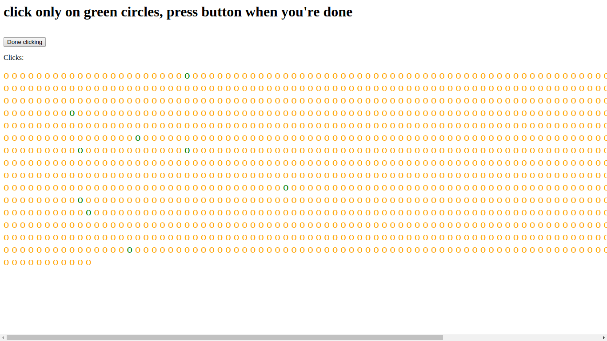

# HistoryTrack

This demo is tricking user into discovering browsing history to attacker(in this case subreddits).

Visited and nonvisited links look differently(visited links are by default purple while nonvisited are blue). It used to be possible to abuse this with getComputedStyle to spy on user's browsing history [[1](http://blog.jeremiahgrossman.com/2006/08/i-know-where-youve-been.html)] [[2](https://davidwalsh.name/jquery-spyjax)].

In 2010 browser vendors fixed it so getComputedStyle returns same value regardless of whether link is visited or not [[3](https://blog.mozilla.org/security/2010/03/31/plugging-the-css-history-leak/)]. However site can still control properties of visited links, this demo contains links to popular(safe for work) subreddits disguised as a clicking game. User is instructed to click only on green circles and press button when he's done. Circles that represent links to subreddits that user already visited will be displayed as green while the ones he did not visit are displayed as orange.

